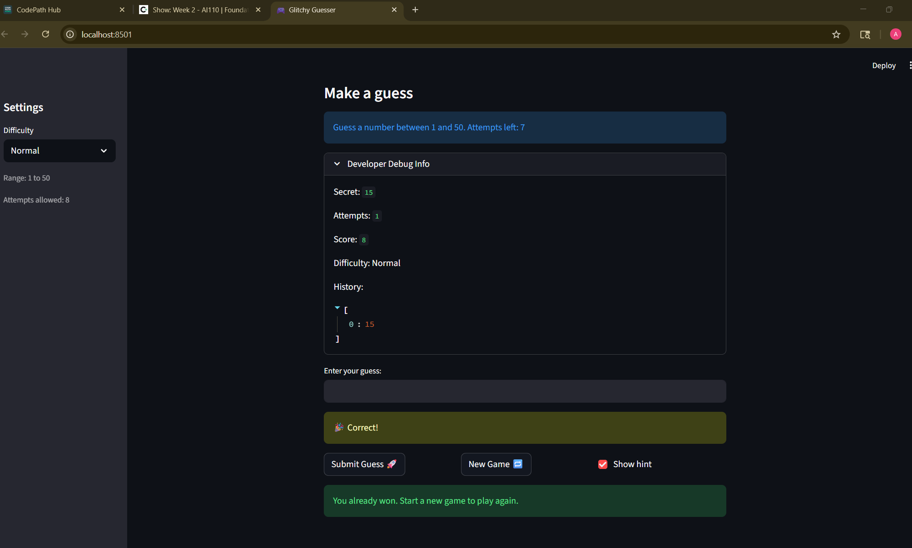
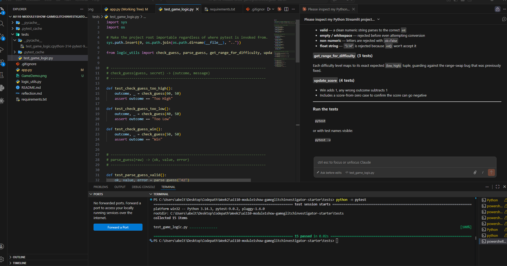

# 🎮 Game Glitch Investigator: The Impossible Guesser

## 🚨 The Situation

You asked an AI to build a simple "Number Guessing Game" using Streamlit.
It wrote the code, ran away, and now the game is unplayable.

- You can't win.
- The hints lie to you.
- The secret number seems to have commitment issues.

## 🛠️ Setup

1. Install dependencies: `pip install -r requirements.txt`
2. Run the broken app: `python -m streamlit run app.py`

## 🕵️‍♂️ Your Mission

1. **Play the game.** Open the "Developer Debug Info" tab in the app to see the secret number. Try to win.
2. **Find the State Bug.** Why does the secret number change every time you click "Submit"? Ask ChatGPT: *"How do I keep a variable from resetting in Streamlit when I click a button?"*
3. **Fix the Logic.** The hints ("Higher/Lower") are wrong. Fix them.
4. **Refactor & Test.**
   - Move the logic into `logic_utils.py`.
   - Run `pytest` in your terminal.
   - Keep fixing until all tests pass!

## 📝 Document Your Experience

- [ ] **Describe the game's purpose.**
  The purpose of this game is to create an interactive number guessing game using Streamlit.
  The program generates a secret number and the player tries to guess it. After each guess,
  the game provides feedback such as "Too High", "Too Low", or "Correct". The goal is to
  guide the player toward the correct number while tracking guesses and maintaining the game state.

- [x] **Detail which bugs you found.**
  During testing and code inspection, several bugs were discovered:

  1. The **Too High / Too Low hint logic** was incorrect, which caused the game to sometimes
     display the wrong hint message after a guess.

  2. The **Show Hint feature** did not properly display the secret number when the hint option
     was enabled.

  3. The **difficulty level logic was not implemented correctly**, so the number range was not
     logically defined based on the selected difficulty.

  4. The **guess history did not reset when starting a new game**, and the **attempt counter
     did not increase correctly** with each guess.

  5. The **score tracking system did not update correctly**, so wins were not being counted
     properly.

  6. When the **difficulty level was changed**, the game continued using the previous secret
     number instead of generating a new one within the correct range for the selected difficulty.

- [x] **Explain what fixes you applied.**
  To fix these issues, the game logic was carefully refactored and corrected:

  1. Corrected the conditional statements so the game now properly determines whether a guess
     is **Too High**, **Too Low**, or **Correct**.

  2. Fixed the **Show Hint functionality** so the secret number is displayed correctly when
     the hint option is enabled.

  3. Reworked the **difficulty level logic** so each difficulty setting now uses a clearly
     defined and appropriate number range.

  4. Fixed the **guess history reset logic** and ensured the **attempt counter increases
     correctly** with each guess.

  5. Corrected the **score tracking system** so wins are properly counted and updated after
     each completed game.

  6. Updated the difficulty switching behavior so **changing the difficulty generates a new
     secret number within the correct range**, instead of continuing with the previous secret
     number.

## 📸 Demo

### Game Screenshot

### Advanced Edge-Case Testing

Below is a screenshot showing that all pytest test cases pass successfully.

## 🚀 Stretch Features

- [ ] [If you choose to complete Challenge 4, insert a screenshot of your Enhanced Game UI here]
